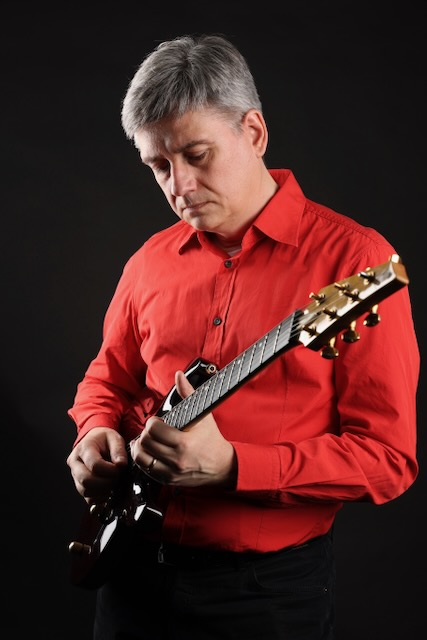
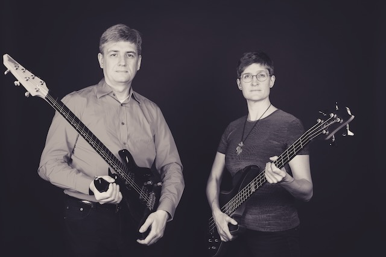
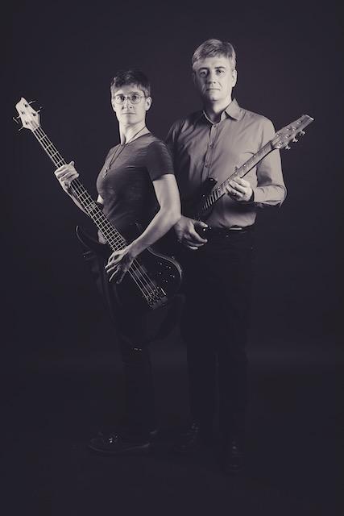
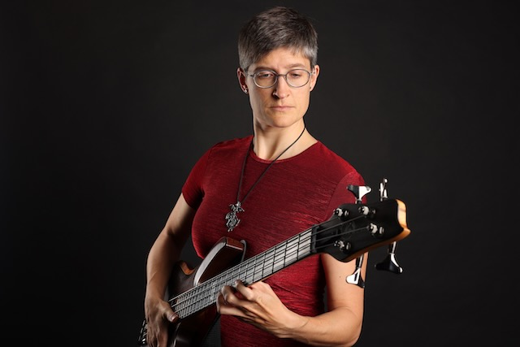
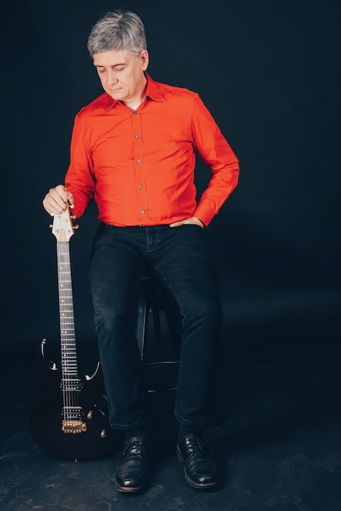

## The Music of maiester
* **Home**: <https://open.spotify.com/track/1Ni3kIHDZeQ0LSIjIXW5Zt>

<iframe style="border-radius:12px" src="https://open.spotify.com/embed/track/1Ni3kIHDZeQ0LSIjIXW5Zt?utm_source=generator" width="100%" height="152" frameBorder="0" allowfullscreen="" allow="autoplay; clipboard-write; encrypted-media; fullscreen; picture-in-picture" loading="lazy"></iframe>

* **Never leave me alone**: <https://open.spotify.com/track/41SX6A2eOgDxg8stHN0Hm1>
* **Keep Away**: <https://open.spotify.com/track/7jNTvdwyXo6Gj3ZGD0Gtgc> 
* **Falling in Love**: <https://open.spotify.com/track/2WGiyLkRgik4Tes3PpGQlz>

## The People behind maiester

### Anke

Anke plays bass, writes the lyrics and sings the lead vocals and most of the background parts.  
Besides that, she manages the website and the merch shop, creates cover images with artificial intelligence, writes books on GitHub and pursues many other hobbies and activities.
### Markus

Markus (born 1973) mainly plays rhythm and lead guitars, occasionally roars in the background vocals, programmes drums and percussion and increasingly tries his hand at keyboard instruments such as synthesizers or pianos.  
When he's not looking for new equipment, he enjoys spending time with his family and is passionate about playing video games.
## A Little Bit of History

Let's start with the name Maiester (pronounced: "Majester"): It is derived from the first letters of the musicians (**M**arkus, **A**nke, **i**Pad) and part of the name of our first rehearsal room (Poly**ester**) in Oldenburg, where the story of our little band began in 2012. After a long time of thinking about an unusual, but not too weird band name, we found this combination very suitable, because it describes our current setup quite well.

iPad? That's right. About two years ago we parted ways with our then human drummer due to different musical orientations and were in desperate need of a replacement because a gig at a local pub was imminent that we couldn't and didn't want to cancel. Performances, no matter in front of which audience, are just what we enjoy the most. Without further ado, we set to work creating an artificial replacement drummer with Garageband on the iPad and it worked amazingly well. Of course, it's a thousand times better and more spontaneous to be able to communicate with real musicians on stage and in the studio, but this decision helped us a lot at that time and since then we've only been working as a duo with electronic support, apart from occasional support from drummers from near and far.

After this drastic change in the setup, we limited ourselves to working in the studio/rehearsal room due to the lack of performance possibilities and, with the support of a local studio (<https://www.die-tonmeisterei.de/>), released two EPs with our songs on the usual platforms (links can be found below).

As the situation for band gigs is slowly but surely easing again, we want to perform more and are rehearsing for a first gig in March.

## Tne Pictures of maiester

## Where To Find All The Music

Bandcamp: <https://maiester.bandcamp.com>  
Spotify: <https://open.spotify.com/artist/0Mbe9bGAgVMZTmWJtujs4y>  
Apple Music: <https://music.apple.com/us/artist/maiester/1601538972>   
YouTube: <https://music.youtube.com/channel/UCJz1QvgpbC6OpfPjQICIrZw>  

## Achievements and Reviews

* **Your Music Live #83 about "Home"**: <https://youtu.be/fp2VjGpnwe0?t=294>
* **Your Music Live #113 about "Never leave me alone"**: <https://youtu.be/2icH6krDqJ0?t=6264>
* **Your Music Live #119 about "Falling in love"**: <https://youtu.be/fs5Wsv9_0rI?t=530>
