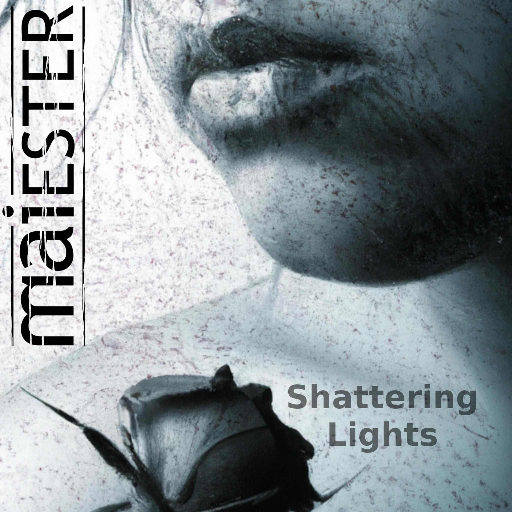

## The latest single _Shattering Lights_ is out
After a break that we used to prepare for a gig in March, we finally had some breathing room to put the necessary finishing touches on our newest song. This time we recorded all the parts ourselves for the first time and also did the final mix. To bring this song to life appropriately, we asked Norbert Peillon again to let his drumming skills play and the result turned out very well. 
For the mastering we have fallen back on the proven services of Role from the "Tonmeisterei".
Contentwise the song is about growing up and the loss of innocence and youth that comes with it.
<!---->

<iframe allow="autoplay *; encrypted-media *; fullscreen *; clipboard-write" frameborder="0" height="450" style="width:100%;max-width:660px;overflow:hidden;border-radius:10px;" sandbox="allow-forms allow-popups allow-same-origin allow-scripts allow-storage-access-by-user-activation allow-top-navigation-by-user-activation" src="https://embed.music.apple.com/de/album/shattering-lights-feat-norbert-peillon-single/1690087878"></iframe>

## Our second Album/EP _Patch2s_
Our second album (or EP) contains - like the first one - a number of pieces that were created over a longer period of time and under different circumstances. Therefore, we thought it appropriate to call this album "Patch2s" as well. The 2 in the name symbolizes the succession from the first album. Unfortunately, when we named the first album, we didn't think about the fact that this could possibly lead to confusion. Today we would certainly do it differently.
<!---->

<iframe allow="autoplay *; encrypted-media *; fullscreen *; clipboard-write" frameborder="0" height="450" style="width:100%;max-width:660px;overflow:hidden;background:transparent;" sandbox="allow-forms allow-popups allow-same-origin allow-scripts allow-storage-access-by-user-activation allow-top-navigation-by-user-activation" src="https://embed.music.apple.com/us/album/patch2s-single/1639093891"></iframe>

## Our first Album: _Patch3s_
We are very proud of our first album "Patch3s", which we recorded within 2 studio days. The name "Patch3s" refers to the fact that all our tracks were created over a longer period of time and under different circumstances, so the individual songs felt more like patches. The 3 in the name replaces the E and is based on internet slang. We thought it was funny. If we had known that we would name our second album similarly and that it could lead to confusion, we probably would have decided differently at the time :)
<!---->

<iframe allow="autoplay *; encrypted-media *; fullscreen *; clipboard-write" frameborder="0" height="450" style="width:100%;max-width:660px;overflow:hidden;background:transparent;" sandbox="allow-forms allow-popups allow-same-origin allow-scripts allow-storage-access-by-user-activation allow-top-navigation-by-user-activation" src="https://embed.music.apple.com/us/album/patch3s-ep/1601548142"></iframe>
